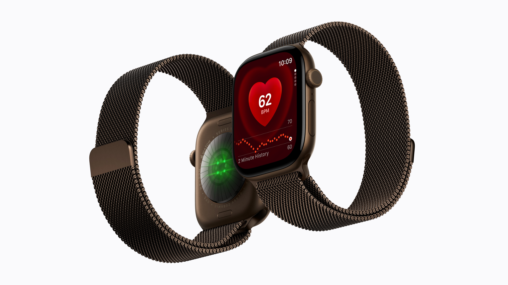
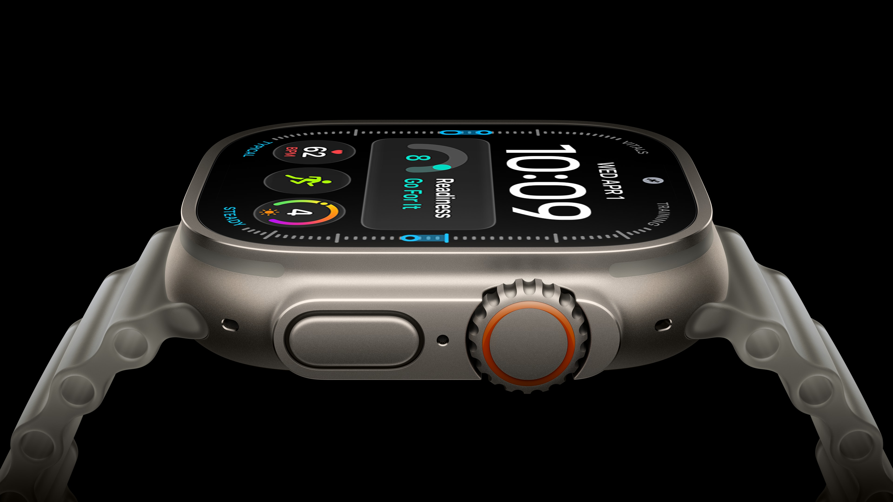

今回のApple Watch Series 12とApple Watch Ultra 4の発表を見て、Apple Watchは今後、Siri AIの中核になっていくのではないかと思った。身に着ける人の生活や状態に関する情報が、これほど密接に集まるデバイスだからだ。こんな話をしていこうと思う。

*Apple Watch Series 12*

*Apple Watch Ultra 4*

突然だが、Apple Watchは、パーソナルコンテキストを凝縮したような存在だと思う。

パーソナルコンテキストとは、その人の行動や習慣、置かれている状況など、個人を理解するための背景情報のことだ。AIがその人に合った支援をするには、質問そのものに加え、こうした背景を把握することが重要になる。

Apple Watchは、日々の活動や睡眠、心拍数などを継続的に記録する。身に着けて使うことで、その人がどのような生活を送り、普段と比べてどのような変化があるのかを知るための情報が蓄積されていく。

この特徴は、AIとの相性がよい。AIに何かを相談する際、私たちは必要に応じて自分の状況を説明する。予定を考えてもらうなら、空いている時間や、やるべきことを伝える。自分に合う提案が欲しければ、普段の習慣や最近の状況も補足する必要がある。

その説明の一部を、本人の許可のもとでデバイスが補えるようになれば、AIとのやり取りは変わる。毎回背景から説明する負担が減り、自分の事情を踏まえた相談を始めやすくなる。

Apple Watchが重要になると思うのは、その背景情報を、日常生活に近いところで取得できるからだ。

今回、Series 12とUltra 4の両方で案内されたAudio Intelligenceは、その役割をさらに広げる機能だと感じた。Live Rewindでは直前の15秒間の会話を文字で確認でき、Siri Recapでは、有効にした状態で会話の要点をあとから振り返れる。これらは年内のベータ提供が予定されている。

活動や身体の状態に関する情報に、日常で交わされる会話の内容も加わる。Apple Watchが、その人の生活を理解するための接点として、より大きな役割を持ち始めているように見える。

例えば、会話で聞いた内容をあとから調べたいとき、これまでは言葉を覚えておいたり、自分でメモを残したりする必要があった。会話の一部を確認し、その内容についてSiriに質問できれば、AIに状況を説明し直す手間を減らせる。

僕が期待しているのは、こうした情報が、今後さらに適切な形でつながっていくことだ。

予定や本人の希望に加え、最近の生活の傾向も踏まえて、一日の過ごし方を一緒に考える。以前の会話の要点を参考にしながら、必要な情報を探す。ユーザーの体温が高いのを検知したらかかりつけの病院を提案する。ユーザーが入力した一文だけでは分からない背景を補えれば、Siri AIの提案は、その人の実際の生活に合ったものになっていく可能性がある。

もちろん、Apple Watchが取得した情報を、Siri AIがすべて横断的に利用できると発表されたわけではない。これは、僕が考える理想の形だ。また、計測値だけで本人の気分や意図まで判断できるわけでもない。本人の言葉と組み合わせ、分からないことは確認する必要がある。

それでも、個人を理解するための情報を継続的に取得できることは、Apple Watchの大きな強みだと思う。質問するたびにユーザーが用意する情報と、生活の中で積み重なる情報。その両方を活用できれば、個人向けAIが支援できる範囲は広がる。

さらにApple Watchは、情報を取得するだけでなく、ユーザーに伝える役割も担える。

必要な情報を腕元で確認し、短く返答する。詳しく確認したい内容はiPhoneやMacで開く。そのように役割を分ければ、日常の小さな用事はApple Watchを通じて済ませられる。自分の状況に関する情報が集まり、その情報を踏まえた支援も同じ場所で受け取れることに意味がある。

ここでいう中核とは、AIの処理をすべてApple Watchで行うという意味ではない。AppleもAudio Intelligenceについて、Watchのチップに加え、iPhone上のモデルやPrivate Cloud Computeを組み合わせると説明している。

処理は複数の場所で分担していても、その人の生活に接する中心的なデバイスはApple Watchになり得る。AIの計算を行う場所と、個人を理解するための情報が得られる場所は、同じである必要がない。

そのためには、どの情報を利用するかを本人が選べることが前提になる。AppleはAudio Intelligenceについて、機能ごとに利用を選択でき、音声録音を作成・保存しない設計だと説明している。今後連携が深まる際にも、情報の利用範囲を把握し、必要なら停止や訂正ができることは欠かせない。

今回の発表で、Apple Watchの価値を改めて考えた。活動や健康に関する記録、日常の会話、そして手元でのやり取り。これらを合わせて見ると、Apple Watchは、個人向けAIに必要なパーソナルコンテキストが集まるデバイスとして捉えられる。

Siri AIが、その人のことを踏まえて支援する存在へと進化するなら、Apple Watchの役割はさらに大きくなると思う。Series 12とUltra 4で示された方向性を見て、Apple Watchが、その中核になり得ると感じている。

## 参考

- [Apple Watch Series 12](https://www.apple.com/jp/apple-watch-series-12/) - Apple公式ページ
- [Apple Watch Ultra 4](https://www.apple.com/jp/apple-watch-ultra-4/) - Apple公式ページ
- [Apple unveils Apple Watch Ultra 4](https://www.apple.com/newsroom/2026/09/apple-unveils-apple-watch-ultra-4/) - Apple Newsroom
- [About Audio Intelligence features on Apple Watch Series 12 and Apple Watch Ultra 4](https://support.apple.com/en-us/148354) - Apple Support
