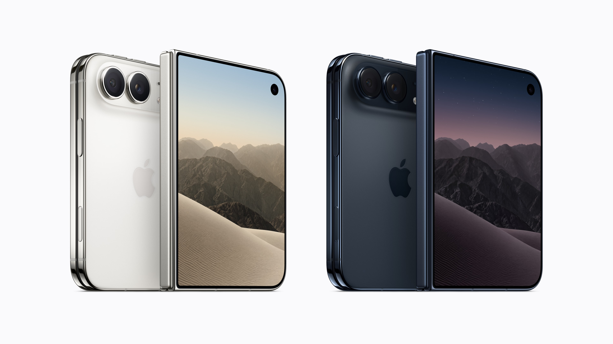
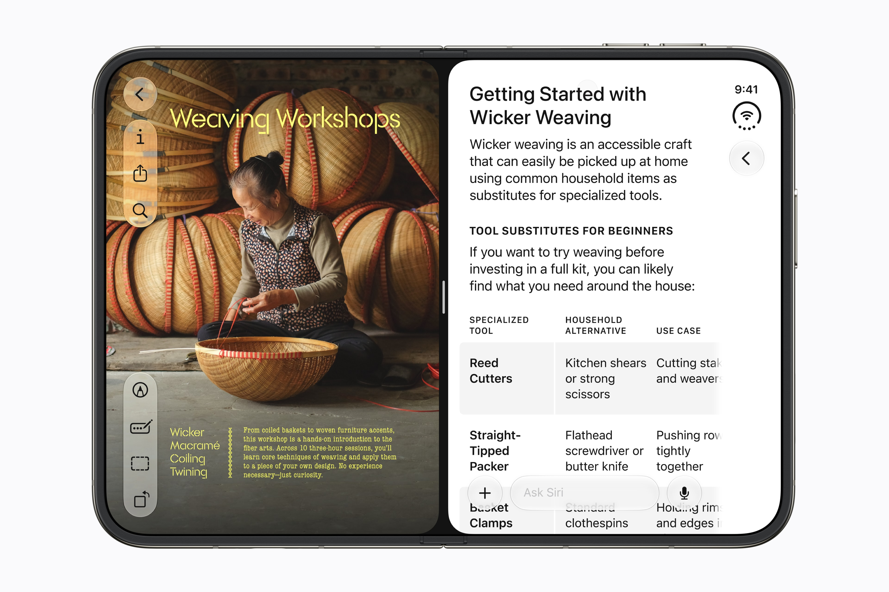

iPhone Duoに搭載されるOSは、iOSだ。しかし、発表された機能やインターフェースを見ると、従来のiPhoneと同じ名前で扱うことに違和感がある。iOSをベースとしながらも、iPadOSの良さを取り入れ、さらに折りたたみ端末ならではの使い方を実現しているからだ。今回はそんなお話。

*iPhone Duo*

iPhone Duoでは、2つのアプリを並べるSplit Viewや、同じアプリのウィンドウを2つ開く機能が利用できる。Dockや操作部分は側面に配置され、折りたたみ状態に応じて表示も変化する。画面の大型化に合わせて、操作の仕組みまで設計し直されている。

*iPhone Duoでのマルチタスク*

こうした構成は、iOSの手軽さと、iPadOSの広い画面を活用する使い勝手を組み合わせたものと捉えられる。閉じた状態で短い操作を済ませ、必要なときには開いて情報を比較したり、別のアプリを参照しながら作業したりする。用途に合わせて、同じ端末の中で作業領域を変えられる。

さらに、Duoの特徴は画面サイズの変化だけではない。背面カメラで撮影しながら外側の画面で構図を確認したり、撮影される側にプレビューを見せたりできる。端末を折り曲げて置き、三脚なしで撮影できる点も、その形状を活用した機能だ。

端末の折り方や置き方、どちらの画面を誰が見るかまでが、ソフトウェアの設計に関わっている。iOSとiPadOSの良さを取り入れたうえで、折りたたみ端末に適した使い方を加えている。この組み合わせに、Duoならではの新しさがある。

<video controls playsinline preload="metadata" src="../images/notes/iphone-duo-os-1.mp4"></video>

ここで気になるのが、iPadOSの存在だ。

Appleは2019年、iPad向けのOSに「iPadOS」という名前を与えた。当時の公式発表では、iOSと同じ基盤の上に、大画面や多用途性を生かす機能を加え、iPad独自の体験を示すための新しい名前だと説明している。

つまり、少なくともiPadOSの命名では、iOSと技術的な土台を共有していることと、独自の名前を持つことは両立していた。名前を分ける根拠となったのは、その端末で何ができ、どのように使うのかという体験の違いだった。

その考え方をDuoにも当てはめるなら、独自のOS名を検討する理由はある。Duoでは、携帯性を優先した状態と、広い画面で作業する状態を行き来できる。加えて、内側と外側の画面を使い分ける機能や、折り曲げて置くことを前提とした使い方もある。従来のiPhoneともiPadとも異なる条件に合わせて、ソフトウェアが設計されている。

独自の名前があれば、購入する側には従来のiPhoneとの違いを伝えやすくなる。開発者に対しても、画面サイズへの対応に加え、折り方や複数の画面を生かしたアプリ設計が求められる製品だと示せるだろう。名称だけで対応アプリが増えるわけではないが、Appleがこの製品のソフトウェアをどう位置付けるかを伝える手段にはなる。

もちろん、iPadOSと同じ結論にする必要はない。iPadは独立した製品カテゴリーであり、DuoはiPhoneの一機種として登場している。iOSという名前を維持すれば、これまでのiPhoneとの連続性や、慣れた操作を引き継げることを伝えやすい。名前を増やすことで、アプリの互換性や操作方法について余計な混乱を招く可能性もある。

そのため、機能が増えたという理由だけで改名すべきだとは思わない。判断の基準になるのは、Duo固有の操作や使い方が、この製品の中心的な価値になっているかどうかだ。

発表内容を見る限り、折りたたみへの対応は補助的な機能にとどまっていない。端末の状態に応じて表示や操作を変えること自体が、Duoの設計の重要な部分を占めている。だからこそ、iPad独自の体験にiPadOSという名前を与えたように、Duoの体験にも、それを表す名前があってよいと思う。

実機での使いやすさや、対応アプリでどこまで一貫した体験が得られるかは、まだ判断できない。それでも、iOSを土台にしているという説明だけでは、Duoの特徴を十分に伝えきれないと感じる。iOSとiPadOSの良さを取り込み、折りたたみ固有の使い方まで実現するOSとして、独自の名前を与える意義はあるのではないだろうか。

参考

[iPhone Duo]([https://www.apple.com/jp/newsroom/2026/09/apple-unveils-iphone-duo/](https://www.apple.com/jp/iphone-duo/)) - Apple公式ページ

[Apple unveils iPhone Duo](https://www.apple.com/jp/newsroom/2026/09/apple-unveils-iphone-duo/) - Apple Newsroom

[The new iPadOS powers unique experiences designed for iPad](https://www.apple.com/jp/newsroom/2019/06/the-new-ipados-powers-unique-experiences-designed-for-ipad/) - Apple Newsroom
